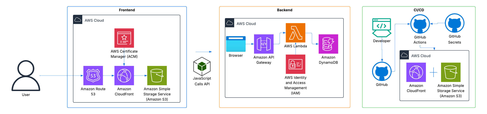

# Cloud Resume Challenge

A serverless resume website built on AWS with complete Infrastructure as Code using Terraform, featuring a real-time visitor counter, automated CI/CD pipeline, and analytics system.

🌐 **Live Website:** [stratajen.net](https://stratajen.net)  
⚙️ **Infrastructure:** 100% managed with Terraform

---

## 📋 Table of Contents

- [Project Overview](#-project-overview)
- [Architecture](#-architecture)
- [Infrastructure as Code (Terraform)](#-infrastructure-as-code-terraform)
- [Technologies Used](#-technologies-used)
- [Project Structure](#-project-structure)
- [Deployment Guide](#-deployment-guide)
- [Troubleshooting](#-troubleshooting)
- [Key Learnings](#-key-learnings)
- [Future Enhancements](#-future-enhancements)
- [Contact](#-contact)

---

## 📋 Project Overview

This project is my implementation of the [Cloud Resume Challenge](https://cloudresumechallenge.dev/), demonstrating hands-on experience with AWS services, Infrastructure as Code with Terraform, and DevOps practices.

---

## 🏗️ Architecture



### Frontend
- **S3** - Static website hosting
- **CloudFront** - CDN with HTTPS
- **Route 53** - Custom domain management
- **ACM** - SSL/TLS certificate

### Backend (Visitor Counter)
- **API Gateway (HTTP API)** - RESTful endpoint
- **Lambda** - Python 3.13 function with atomic counter
- **DynamoDB** - Visitor count storage
- **IAM** - Least-privilege permissions

### Analytics System
- **CloudFront Access Logs** - Request logging
- **S3** - Log file storage
- **Athena** - SQL queries on log data
- **Lambda** - Daily analytics processing
- **SNS** - Email notification delivery
- **EventBridge** - Scheduled daily triggers (8am EST)

### CI/CD Pipeline
- **GitHub Actions** - Automated deployment workflow
- **AWS CLI** - S3 sync and CloudFront invalidation
- **GitHub Secrets** - Secure credential management

---

## ⚙️ Infrastructure as Code (Terraform)

All infrastructure is managed with Terraform v1.13.5.

### Terraform Resources

#### **Storage & Content Delivery**
- `aws_s3_bucket.website` - Static website bucket
- `aws_s3_bucket_website_configuration.website` - Website hosting config
- `aws_s3_bucket.cloudfront_logs` - CloudFront access logs bucket
- `aws_s3_bucket_ownership_controls.cloudfront_logs` - ACL configuration
- `aws_s3_bucket_acl.cloudfront_logs` - Log delivery permissions
- `aws_cloudfront_distribution.website` - CDN distribution

#### **DNS**
- `data.aws_route53_zone.main` - Hosted zone lookup
- `aws_route53_record.root` - A record for apex domain
- `aws_route53_record.www` - A record for www subdomain
- `aws_route53_record.cert_validation` - ACM certificate validation

#### **Backend**
- `aws_dynamodb_table.visitor_counter` - Visitor counter table
- `aws_lambda_function.visitor_counter` - Counter Lambda
- `aws_iam_role.lambda_role` - Lambda execution role
- `aws_iam_role_policy.lambda_dynamodb_policy` - Restricted DynamoDB access
- `aws_iam_role_policy_attachment.lambda_basic_execution` - CloudWatch logs

#### **API**
- `aws_apigatewayv2_api.visitor_counter` - HTTP API
- `aws_apigatewayv2_integration.lambda` - Lambda integration
- `aws_apigatewayv2_route.post` - POST /count route
- `aws_apigatewayv2_stage.default` - API stage
- `aws_lambda_permission.api_gateway` - API Gateway invoke permission

### Project Structure
```
terraform/
├── main.tf                  # Provider configuration
├── variables.tf             # Variable definitions
├── terraform.tfvars         # Variable values (gitignored)
├── s3.tf                    # S3 resources
├── dynamodb.tf              # DynamoDB table
├── lambda.tf                # Lambda function and IAM
├── apigateway.tf            # API Gateway resources
├── cloudfront.tf            # CloudFront distribution
├── route53.tf               # DNS records
└── .gitignore               # Protects state files
```

### Security Practices

**Secrets Protection:**
- Sensitive values in `terraform.tfvars` (gitignored)
- No hardcoded credentials or account IDs
- State file protected with `.gitignore`

**Least-Privilege IAM:**
- Lambda has ONLY UpdateItem + GetItem permissions
- Specific DynamoDB table access only
- Removed `AmazonDynamoDBFullAccess` managed policy

**Resource Tagging:**
- All resources tagged: Name, Environment, ManagedBy
- Enables cost tracking and management

---

## 🛠️ Technologies Used

**Frontend:**
- HTML5, CSS3, JavaScript
- Responsive design

**Backend:**
- Python 3.13
- Boto3 (AWS SDK)

**Infrastructure as Code:**
- Terraform v1.13.5
- AWS Provider

**AWS Services:**
- S3, CloudFront, Route 53, ACM
- Lambda, API Gateway, DynamoDB
- Athena, SNS, EventBridge
- IAM

**DevOps:**
- GitHub Actions
- Git version control
- AWS CLI

---

## 📁 Project Structure
```
cloud-resume-challenge/
├── frontend/
│   ├── index.html              # Resume website
│   ├── styles.css              # Styling
│   └── script.js               # Visitor counter
├── backend/
│   ├── lambda_function.py      # Visitor counter Lambda
│   └── lambda_function.zip     # Deployment package (gitignored)
├── analytics/
│   └── analytics_lambda.py     # Analytics Lambda
├── terraform/
│   ├── main.tf                 # Provider config
│   ├── variables.tf            # Variables
│   ├── terraform.tfvars        # Values (gitignored)
│   ├── s3.tf                   # S3 resources
│   ├── dynamodb.tf             # DynamoDB
│   ├── lambda.tf               # Lambda + IAM
│   ├── apigateway.tf           # API Gateway
│   ├── cloudfront.tf           # CloudFront
│   ├── route53.tf              # DNS
│   └── .gitignore              # State protection
├── images/
│   └── Cloud-Resume-Architecture.png  # Architecture diagram
├── .github/
│   └── workflows/
│       └── deploy.yml          # CI/CD pipeline
└── README.md
```

---

## 🚀 Deployment Guide

### Prerequisites
- AWS Account
- Terraform installed (v1.13.5+)
- AWS CLI configured
- GitHub Account
- Custom domain (optional)

### Steps

#### 1. Clone Repository
```bash
git clone https://github.com/JenMagruder/cloud-resume-challenge.git
cd cloud-resume-challenge
```

#### 2. Configure Terraform
```bash
cd terraform
cp terraform.tfvars.example terraform.tfvars
# Edit terraform.tfvars with your values
```

#### 3. Deploy Infrastructure
```bash
terraform init
terraform plan
terraform apply
```

#### 4. Upload Frontend
```bash
cd ../frontend
aws s3 sync . s3://your-bucket-name/
aws cloudfront create-invalidation --distribution-id YOUR_ID --paths "/*"
```

#### 5. Configure CI/CD
Add GitHub Secrets:
- `AWS_ACCESS_KEY_ID`
- `AWS_SECRET_ACCESS_KEY`
- `S3_BUCKET`
- `CLOUDFRONT_DISTRIBUTION_ID`

---

## 🔧 Troubleshooting

### Error 1: CloudFront Logging ACL Configuration

**Error:**
```
Error: updating CloudFront Distribution (ELGFDIW5LH2XK): 
InvalidArgument: The S3 bucket that you specified for CloudFront logs 
does not enable ACL access: stratajen-cloudfront-logs.s3.amazonaws.com
```

**Cause:**  
S3 Public Access Block setting `IgnorePublicAcls = true` prevented CloudFront log delivery ACL from working.

**Solution:**
```bash
aws s3api put-public-access-block \
  --bucket stratajen-cloudfront-logs \
  --public-access-block-configuration \
  "BlockPublicAcls=true,IgnorePublicAcls=false,BlockPublicPolicy=true,RestrictPublicBuckets=true"
```

---

### Error 2: IAM Role Import Path Mismatch

**Error:**
```
Error: reading IAM Role (service-role/visitor-counter-role-t3za3qyi): 
ValidationError: The specified value for roleName is invalid. 
It must contain only alphanumeric characters and/or the following: +=,.@_-
```

**Cause:**  
The `/` in `service-role/visitor-counter-role-t3za3qyi` is part of the ARN path, not the role name.

**Solution:**
1. Found actual role name:
```bash
aws lambda get-function --function-name visitor-counter --query 'Configuration.Role'
```

2. Imported with just the role name:
```bash
terraform import aws_iam_role.lambda_role visitor-counter-role-t3za3qyi
```

3. Added `path = "/service-role/"` to Terraform code

---

### Error 3: S3 ACL Not Supported

**Error:**
```
An error occurred (AccessControlListNotSupported) when calling the 
PutBucketAcl operation: The bucket does not allow ACLs
```

**Cause:**  
Default S3 bucket configuration blocked ACLs.

**Solution:**  
Configured ownership controls in Terraform:
```hcl
resource "aws_s3_bucket_ownership_controls" "cloudfront_logs" {
  bucket = aws_s3_bucket.cloudfront_logs.id
  rule {
    object_ownership = "BucketOwnerPreferred"
  }
}
```

---

## 📈 Key Learnings

- **Infrastructure as Code**: Migrated existing AWS resources to Terraform
- **Import Strategies**: Imported 13 AWS resources into Terraform state
- **Serverless Architecture**: Built with Lambda and API Gateway
- **Security**: Applied least-privilege IAM policies
- **Troubleshooting**: Debugged ACL configuration and import issues
- **DevOps**: Automated deployment with GitHub Actions

---

## 🔮 Future Enhancements

- [ ] AWS Secrets Manager integration for analytics Lambda
- [ ] Lambda unit tests with pytest
- [ ] Blog section on website
- [ ] Enhanced CloudWatch monitoring dashboards

---

## 📧 Contact

**Jennifer Magruder**

- 📧 Email: [strataspherejen@gmail.com](mailto:strataspherejen@gmail.com)
- 💼 LinkedIn: [jennifer-magruder](https://www.linkedin.com/in/jennifer-magruder)
- 💻 GitHub: [JenMagruder](https://github.com/JenMagruder)
- 🌐 Website: [stratajen.net](https://stratajen.net)

---

## 🙏 Acknowledgments

- [Forrest Brazeal](https://forrestbrazeal.com/) for creating the Cloud Resume Challenge
- [Andrew Brown](https://www.exampro.co/) for ExamPro Terraform cohort guidance
- AWS documentation and community

---

**⭐ If you found this project helpful, please consider giving it a star!**