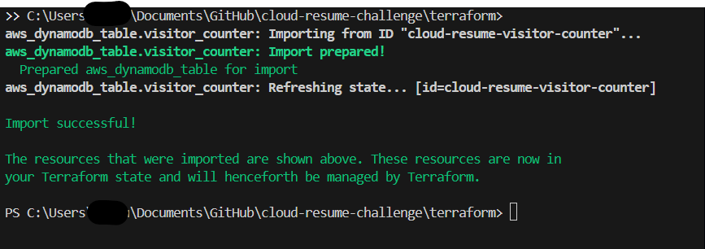
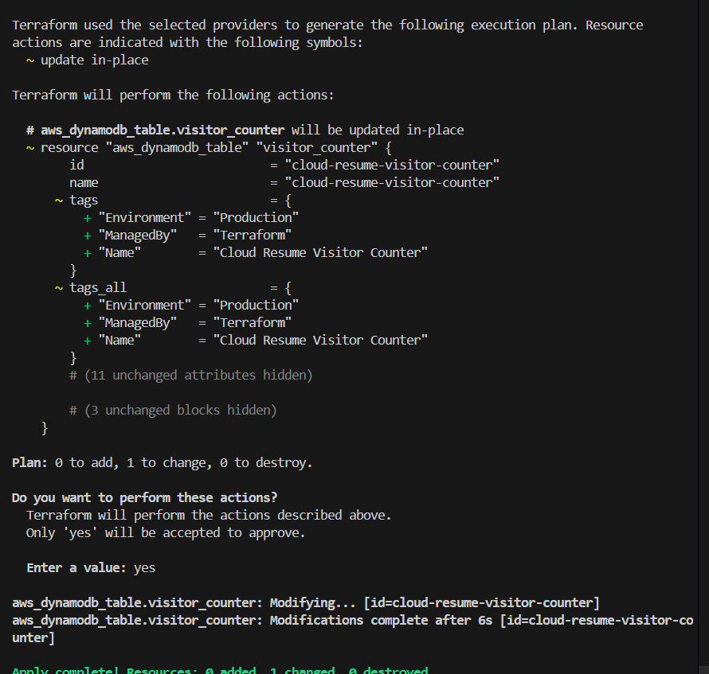
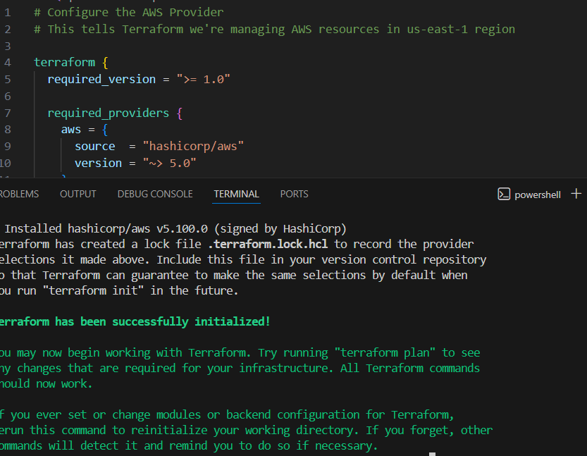
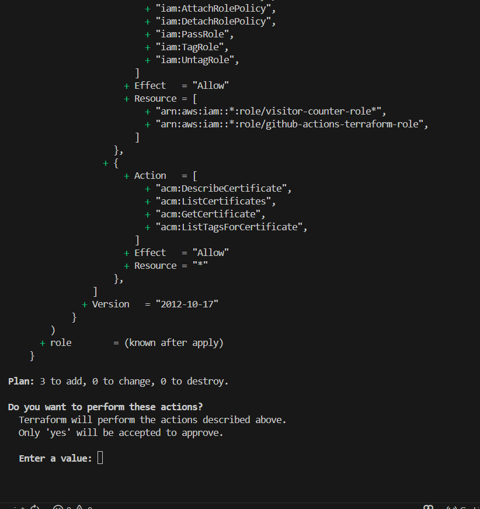
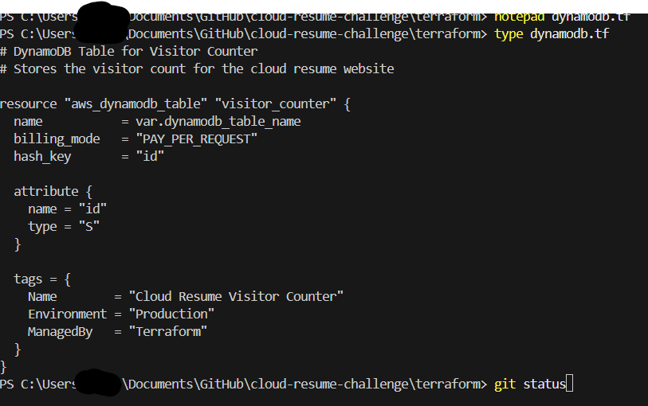

#  Terraform Infrastructure Documentation

##  Overview

This directory contains the Terraform configuration for my Cloud Resume Challenge infrastructure, migrated from manually-created AWS Console resources to Infrastructure as Code.

**Infrastructure managed:**

- **Static website hosting** - S3 bucket with CloudFront CDN and Route53 DNS
- **Serverless visitor counter** - Lambda function with DynamoDB table and API Gateway
- **Remote state management** - S3 backend with DynamoDB locking for concurrent access control
- **OIDC authentication** - Secure GitHub Actions deployment without stored AWS credentials

**Current resources:**
- 2 S3 buckets (website hosting, CloudFront access logs)
- 1 CloudFront distribution with custom domain
- 1 Lambda function (Python 3.13)
- 2 DynamoDB tables (visitor counter, Terraform state lock)
- 1 API Gateway HTTP API
- Route53 DNS records
- IAM roles and policies

---

##  Why I Chose Terraform

I wanted to learn Terraform and make it into a working project. Declarative infrastructure management made sense for managing my resume site, and having everything version controlled in Git means I can track changes and recreate the infrastructure if needed. I considered CloudFormation since it's AWS-native, but Terraform has better community support and more learning resources available.

**Alternative I considered:** AWS CloudFormation is AWS-native and doesn't require state management, but Terraform has broader community support and isn't cloud-specific.

---

##  Migration to Terraform

My infrastructure was already live and linked in active job applications, so I had to import existing resources into Terraform state instead of recreating everything. This allowed zero downtime migration while learning IaC.

**Successful DynamoDB import:**



**Applying Terraform changes after import:**



---

##  Issues Encountered During Migration

### Error 1: CloudFront Logging ACL Configuration

**Problem:**
```
Error: Error putting S3 bucket ACL: InvalidArgument: S3 bucket does not enable ACL access
  status code: 400
```

**Cause:**
CloudFront logging requires ACL access to write logs to S3 bucket. Default S3 security settings block ACLs with `IgnorePublicAcls = true`.

**Solution:**
```bash
aws s3api put-public-access-block \
  --bucket stratajen-cloudfront-logs \
  --public-access-block-configuration \
  "BlockPublicAcls=true,IgnorePublicAcls=false,BlockPublicPolicy=true,RestrictPublicBuckets=true"
```

Then add bucket ownership controls:
```hcl
resource "aws_s3_bucket_ownership_controls" "cloudfront_logs" {
  bucket = aws_s3_bucket.cloudfront_logs.id
  rule {
    object_ownership = "BucketOwnerPreferred"
  }
}
```

**Lesson:** AWS security defaults conflict with CloudFront logging requirements. Must explicitly enable ACL support while maintaining other security controls.

---

### Error 2: IAM Role Import Path Mismatch

**Problem:**
```
Error: ValidationError: 1 validation error detected: Value '/service-role/visitor-counter-role' 
at 'roleName' failed to satisfy constraint: Member must satisfy regular expression pattern: [\w+=,.@-]+
```

**Cause:**
IAM role ARN includes path (`/service-role/`), but Terraform import expects only the role name.

**Wrong command:**
```bash
terraform import aws_iam_role.lambda_role /service-role/visitor-counter-role
```

**Correct command:**
```bash
terraform import aws_iam_role.lambda_role visitor-counter-role
```

**Then add path to Terraform config:**
```hcl
resource "aws_iam_role" "lambda_role" {
  name = "visitor-counter-role-t3za3qyi"
  path = "/service-role/"  # ← Add this
  # ...
}
```

**Lesson:** ARN paths and role names are separate. Import uses name only, but Terraform config must specify path to match existing resource.

---

### Error 3: S3 ACL Not Supported

**Problem:**
```
Error: AccessControlListNotSupported: The bucket does not allow ACLs
```

**Cause:**
Tried to set `acl = "log-delivery-write"` on CloudFront logs bucket, but bucket configuration didn't allow ACLs.

**Solution:**
First enable ACL support with ownership controls:
```hcl
resource "aws_s3_bucket_ownership_controls" "cloudfront_logs" {
  bucket = aws_s3_bucket.cloudfront_logs.id
  rule {
    object_ownership = "BucketOwnerPreferred"
  }
}
```

Then apply ACL (with dependency):
```hcl
resource "aws_s3_bucket_acl" "cloudfront_logs" {
  depends_on = [aws_s3_bucket_ownership_controls.cloudfront_logs]
  bucket     = aws_s3_bucket.cloudfront_logs.id
  acl        = "log-delivery-write"
}
```

**Lesson:** S3 ACL configuration requires two steps: (1) enable ownership controls, (2) set ACL. Use `depends_on` to ensure correct order.

---

##  Remote State Configuration

### Why Remote State?

GitHub Actions runners are ephemeral and destroyed after each run. Without remote state, each run starts with blank state and tries to recreate everything, causing conflicts. Remote state in S3 is accessible by both local machine and GitHub Actions, so both environments see the same infrastructure state. State is backed up and versioned in S3.

---

### S3 Backend Setup

Created separate bucket `stratajen-terraform-state` for state storage with versioning enabled.

**Configuration:**

```hcl
# remote-state-setup.tf
resource "aws_s3_bucket" "terraform_state" {
  bucket = "stratajen-terraform-state"
  
  lifecycle {
    prevent_destroy = true  # Safety: never accidentally delete state
  }
}

resource "aws_s3_bucket_versioning" "terraform_state" {
  bucket = aws_s3_bucket.terraform_state.id
  versioning_configuration {
    status = "Enabled"
  }
}

resource "aws_s3_bucket_server_side_encryption_configuration" "terraform_state" {
  bucket = aws_s3_bucket.terraform_state.id
  rule {
    apply_server_side_encryption_by_default {
      sse_algorithm = "AES256"
    }
  }
}
```

---

### DynamoDB State Locking

**Configuration:**
```hcl
resource "aws_dynamodb_table" "terraform_locks" {
  name         = "terraform-state-lock"
  billing_mode = "PAY_PER_REQUEST"
  hash_key     = "LockID"

  attribute {
    name = "LockID"
    type = "S"
  }
}
```

---

### State Migration

Created S3 bucket and DynamoDB table using local state, then migrated local state to S3 backend using `terraform init -migrate-state`.

**Successful Terraform initialization with remote state:**



---

##  OIDC Authentication for GitHub Actions

### Why OIDC Instead of Access Keys?

I chose OIDC because it's the modern best practice for CI/CD authentication. Access keys are permanent credentials stored in GitHub Secrets that need manual rotation, while OIDC credentials expire after 1 hour and rotate automatically. If GitHub Actions gets compromised, OIDC limits the damage to just that 1 hour window instead of permanent access.

---

### OIDC Provider Setup

```hcl
resource "aws_iam_openid_connect_provider" "github_actions" {
  url = "https://token.actions.githubusercontent.com"

  client_id_list = [
    "sts.amazonaws.com"
  ]

  thumbprint_list = [
    "6938fd4d98bab03faadb97b34396831e3780aea1"
  ]
}
```

---

### IAM Role

```hcl
resource "aws_iam_role" "github_actions" {
  name = "github-actions-terraform-role"

  assume_role_policy = jsonencode({
    Version = "2012-10-17"
    Statement = [
      {
        Effect = "Allow"
        Principal = {
          Federated = aws_iam_openid_connect_provider.github_actions.arn
        }
        Action = "sts:AssumeRoleWithWebIdentity"
        Condition = {
          StringEquals = {
            "token.actions.githubusercontent.com:aud" = "sts.amazonaws.com"
          }
          StringLike = {
            "token.actions.githubusercontent.com:sub" = "repo:JenMagruder/cloud-resume-challenge:*"
          }
        }
      }
    ]
  })
}
```

---

### Permissions Policy

IAM policy scoped to specific project resources:

```hcl
# S3 - ONLY these buckets
Resource = [
  "arn:aws:s3:::stratajen.net*",
  "arn:aws:s3:::stratajen-cloudfront-logs",
  "arn:aws:s3:::stratajen-terraform-state"
]

# Lambda - ONLY visitor-counter functions
Resource = "arn:aws:lambda:us-east-1:*:function:visitor-counter*"

# DynamoDB - ONLY these tables
Resource = [
  "arn:aws:dynamodb:us-east-1:*:table/cloud-resume-visitor-counter",
  "arn:aws:dynamodb:us-east-1:*:table/terraform-state-lock"
]
```

**OIDC IAM policy configuration:**



---

### GitHub Actions Workflow

```yaml
jobs:
  deploy-frontend:
    runs-on: ubuntu-latest
    
    permissions:
      id-token: write
      contents: read
    
    steps:
      - name: Checkout code
        uses: actions/checkout@v3
      
      - name: Configure AWS credentials
        uses: aws-actions/configure-aws-credentials@v4
        with:
          role-to-assume: arn:aws:iam::068741930680:role/github-actions-terraform-role
          aws-region: us-east-1
```

---

##  File Structure

```
terraform/
 backend.tf                  # S3 backend configuration
 remote-state-setup.tf       # S3 bucket + DynamoDB table for state
 oidc.tf                     # OIDC provider + IAM role for GitHub Actions
 provider.tf                 # AWS provider configuration
 variables.tf                # Variable definitions
 terraform.tfvars            # Variable values (gitignored)

 s3.tf                       # Website bucket + CloudFront logs bucket
 cloudfront.tf               # CDN distribution
 route53.tf                  # DNS records
 lambda.tf                   # Visitor counter function + IAM role
 dynamodb.tf                 # Visitor counter table
 apigateway.tf               # HTTP API

 .terraform.lock.hcl         # Provider version lock file (committed)
```

**What each file does:**

**`backend.tf`** - Tells Terraform to use S3 for state storage
**`remote-state-setup.tf`** - Creates the infrastructure needed for remote state
**`oidc.tf`** - Sets up GitHub Actions authentication
**`provider.tf`** - Configures AWS provider and region
**`variables.tf`** - Defines variables (types, descriptions)
**`terraform.tfvars`** - Actual values for variables (GITIGNORED - contains your specific values)

**Resource files:**
- Each file groups related resources for clarity
- Could all be in one file, but separate files improve organization

**`.terraform.lock.hcl`** - Locks provider versions for consistency
- **Should be committed** to Git
- Ensures GitHub Actions uses same provider versions as local development

**Example Terraform code (DynamoDB table):**



---

##  Architecture Decisions

### Why S3 Remote Backend?

I chose S3 to save money. It's essentially free compared to Terraform Cloud at $20 per user per month, and I already have full control within AWS.

---

### Why DynamoDB for State Locking?

DynamoDB prevents state corruption when both GitHub Actions and local development run Terraform concurrently. It's essentially free with pay-per-request billing.

---

### Why OIDC Instead of Access Keys?

I chose OIDC because it's the modern best practice for CI/CD authentication. Access keys are permanent credentials stored in GitHub Secrets that need manual rotation, while OIDC credentials expire after 1 hour and rotate automatically. If GitHub Actions gets compromised, OIDC limits the damage to just that 1 hour window instead of permanent access.

---

##  Lessons Learned

### 1. Import Existing Resources Before Recreating

**Mistake I avoided:** Destroying production infrastructure to start with Terraform.

**Better approach:** Import existing resources, then manage with Terraform.

**Result:** Zero downtime migration, no data loss, website stayed online throughout process.

---

### 2. Remote State is Non-Negotiable for CI/CD

**Wasted time:** Initially tried to make GitHub Actions work with local state (impossible).

**Realization:** Ephemeral runners can't persist local files.

**Solution:** Set up remote state FIRST if you plan to use CI/CD.

---

### 3. IAM Import Path Gotcha

**Error encountered:** Importing IAM role failed due to path confusion.

**Learning:** ARN paths and role names are separate. Import uses name only, but Terraform config must specify path to match existing resource.

**Time saved:** Document this for others hitting same issue.

---

### 4. CloudFront Logging Requires Special S3 Config

**Not obvious:** CloudFront logging needs ACL support, which conflicts with modern S3 security defaults.

**Solution:** Explicitly configure bucket ownership controls before enabling ACLs.

**Documentation:** AWS docs don't make this clear. Found solution through trial and error.

---

### 5. OIDC Thumbprint is Critical

**Initial failures:** OIDC authentication failed due to wrong thumbprint.

**Correct thumbprint:** `6938fd4d98bab03faadb97b34396831e3780aea1` (GitHub's current certificate)

**Lesson:** Double-check thumbprint against GitHub's documentation. Incorrect thumbprint = authentication fails.

---

### 6. Repository Restriction is Essential

**Security insight:** Without repository restriction in trust policy, ANY GitHub repo could assume your role.

**Critical line:**
```hcl
"token.actions.githubusercontent.com:sub" = "repo:YourUsername/YourRepo:*"
```

**Impact:** Only YOUR specific repository can authenticate. Prevents unauthorized access.

---

##  What's Next for This Project

Areas I'm considering for future enhancements:

- **AWS Secrets Manager** - Move Lambda email credentials out of environment variables

---

##  References

- **Terraform: Up and Running** by Yevgeniy Brikman - Comprehensive guide to Terraform best practices, remote state, and production workflows
- [Terraform S3 Backend Documentation](https://developer.hashicorp.com/terraform/language/settings/backends/s3)
- [GitHub Actions OIDC with AWS](https://docs.github.com/en/actions/deployment/security-hardening-your-deployments/configuring-openid-connect-in-amazon-web-services)
- [AWS IAM OIDC Identity Providers](https://docs.aws.amazon.com/IAM/latest/UserGuide/id_roles_providers_create_oidc.html)
- [Terraform Import Documentation](https://developer.hashicorp.com/terraform/cli/import)