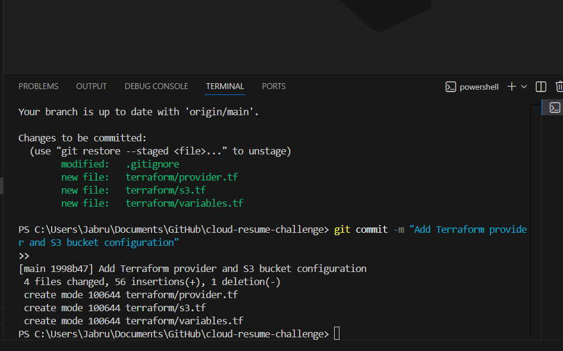

# 🏗️ Terraform Infrastructure Documentation

## 📋 Overview

This directory contains the Terraform configuration for my Cloud Resume Challenge infrastructure, migrated from manually-created AWS Console resources to Infrastructure as Code.

**Infrastructure managed:**

- **Static website hosting** - S3 bucket with CloudFront CDN and Route53 DNS
- **Serverless visitor counter** - Lambda function with DynamoDB table and API Gateway
- **Remote state management** - S3 backend with DynamoDB locking for concurrent access control
- **OIDC authentication** - Secure GitHub Actions deployment without stored AWS credentials

**Current resources:**
- 2 S3 buckets (website hosting, CloudFront access logs)
- 1 CloudFront distribution with custom domain
- 1 Lambda function (Python 3.13)
- 2 DynamoDB tables (visitor counter, Terraform state lock)
- 1 API Gateway HTTP API
- Route53 DNS records
- IAM roles and policies

---

## 🤔 Why I Chose Terraform

I selected Terraform for this project's Infrastructure as Code because:

1. **Declarative configuration** - I define the desired end state, Terraform figures out how to get there
2. **Version control integration** - All infrastructure changes tracked in Git with full history
3. **Reproducibility** - The entire infrastructure can be recreated from code if needed
4. **Multi-cloud capability** - Not locked into AWS if I want to expand to other providers later
5. **State management** - Terraform tracks actual infrastructure state vs desired state, preventing drift

**Alternative I considered:** AWS CloudFormation is AWS-native and doesn't require state management, but Terraform has broader community support and isn't cloud-specific.

---

## 🚀 Migration Journey: Console → Terraform

### 🎯 The Problem

My infrastructure was initially created manually in the AWS Console:
- S3 buckets configured through UI
- CloudFront distribution set up with click-through wizards
- Lambda functions deployed manually
- No infrastructure-as-code documentation

**Why migrate to Terraform:**
- **Reproducibility** - Can recreate entire infrastructure from code if needed
- **Version control** - All infrastructure changes tracked in Git
- **Automation** - Enable GitHub Actions to deploy infrastructure changes
- **Documentation** - Code IS the documentation (self-documenting)
- **Best practices** - Industry-standard IaC approach

### ✅ The Solution: Import Existing Resources

Rather than destroying and recreating everything, I imported existing resources into Terraform state.

**Import process:**
```bash
# Step 1: Write Terraform configuration matching existing resource
# Step 2: Import actual resource into state
terraform import aws_s3_bucket.website <bucket-id>
terraform import aws_dynamodb_table.visitor_counter cloud-resume-visitor-counter
terraform import aws_lambda_function.visitor_counter visitor-counter
# ... etc
```

**Successful DynamoDB import:**


**Applying Terraform changes after import:**


**Why import vs recreate:**
- ✅ Zero downtime (website stays online)
- ✅ Preserve data (DynamoDB visitor count)
- ✅ Keep DNS records active
- ✅ No service interruption

---

## ⚠️ Issues Encountered During Migration

### Error 1: CloudFront Logging ACL Configuration

**Problem:**
```
Error: Error putting S3 bucket ACL: InvalidArgument: S3 bucket does not enable ACL access
  status code: 400
```

**Cause:**
CloudFront logging requires ACL access to write logs to S3 bucket. Default S3 security settings block ACLs with `IgnorePublicAcls = true`.

**Solution:**
```bash
aws s3api put-public-access-block \
  --bucket stratajen-cloudfront-logs \
  --public-access-block-configuration \
  "BlockPublicAcls=true,IgnorePublicAcls=false,BlockPublicPolicy=true,RestrictPublicBuckets=true"
```

Then add bucket ownership controls:
```hcl
resource "aws_s3_bucket_ownership_controls" "cloudfront_logs" {
  bucket = aws_s3_bucket.cloudfront_logs.id
  rule {
    object_ownership = "BucketOwnerPreferred"
  }
}
```

**Lesson:** AWS security defaults conflict with CloudFront logging requirements. Must explicitly enable ACL support while maintaining other security controls.

---

### Error 2: IAM Role Import Path Mismatch

**Problem:**
```
Error: ValidationError: 1 validation error detected: Value '/service-role/visitor-counter-role' 
at 'roleName' failed to satisfy constraint: Member must satisfy regular expression pattern: [\w+=,.@-]+
```

**Cause:**
IAM role ARN includes path (`/service-role/`), but Terraform import expects only the role name.

**Wrong command:**
```bash
terraform import aws_iam_role.lambda_role /service-role/visitor-counter-role
```

**Correct command:**
```bash
terraform import aws_iam_role.lambda_role visitor-counter-role
```

**Then add path to Terraform config:**
```hcl
resource "aws_iam_role" "lambda_role" {
  name = "visitor-counter-role-t3za3qyi"
  path = "/service-role/"  # ← Add this
  # ...
}
```

**Lesson:** ARN paths and role names are separate. Import uses name only, but Terraform config must specify path to match existing resource.

---

### Error 3: S3 ACL Not Supported

**Problem:**
```
Error: AccessControlListNotSupported: The bucket does not allow ACLs
```

**Cause:**
Tried to set `acl = "log-delivery-write"` on CloudFront logs bucket, but bucket configuration didn't allow ACLs.

**Solution:**
First enable ACL support with ownership controls:
```hcl
resource "aws_s3_bucket_ownership_controls" "cloudfront_logs" {
  bucket = aws_s3_bucket.cloudfront_logs.id
  rule {
    object_ownership = "BucketOwnerPreferred"
  }
}
```

Then apply ACL (with dependency):
```hcl
resource "aws_s3_bucket_acl" "cloudfront_logs" {
  depends_on = [aws_s3_bucket_ownership_controls.cloudfront_logs]
  bucket     = aws_s3_bucket.cloudfront_logs.id
  acl        = "log-delivery-write"
}
```

**Lesson:** S3 ACL configuration requires two steps: (1) enable ownership controls, (2) set ACL. Use `depends_on` to ensure correct order.

---

## 🗄️ Remote State Configuration

### Why Remote State?

**The Problem with Local State:**

GitHub Actions runners are ephemeral - they're destroyed after each workflow run. With local state:

```
GitHub Actions Run #1:
├── Checks out code
├── No terraform.tfstate file found
├── Thinks infrastructure doesn't exist
└── Tries to create everything again → CONFLICTS!
```

**Without remote state:**
- Each GitHub Actions run starts with blank state
- Attempts to recreate S3 buckets (fails - names must be unique)
- Can't track what resources exist
- No coordination between local development and CI/CD

**With remote state in S3:**
- State file stored in S3, accessible by both local machine and GitHub Actions
- Both environments see same infrastructure state
- Can make changes from anywhere
- State is backed up and versioned

---

### S3 Backend Setup

**Created separate bucket for state:**
- **Bucket name:** `stratajen-terraform-state`
- **Encryption:** AES-256 (state contains sensitive resource IDs)
- **Versioning:** Enabled (rollback if state gets corrupted)
- **Public access:** Blocked on all levels

**Why separate bucket instead of using website bucket?**

| Concern | Website Bucket | State Bucket |
|---------|---------------|--------------|
| Public access | Needed for CloudFront | Must be 100% private |
| Traffic | High (website visitors) | Low (only terraform runs) |
| Security impact if compromised | Redeploy website | Lose track of ALL infrastructure |
| Access permissions | CloudFront + GitHub Actions | Only Terraform |

**Cost difference:** ~$0.001/month (negligible). Worth it for security isolation.

**Configuration:**

```hcl
# remote-state-setup.tf
resource "aws_s3_bucket" "terraform_state" {
  bucket = "stratajen-terraform-state"
  
  lifecycle {
    prevent_destroy = true  # Safety: never accidentally delete state
  }
}

resource "aws_s3_bucket_versioning" "terraform_state" {
  bucket = aws_s3_bucket.terraform_state.id
  versioning_configuration {
    status = "Enabled"
  }
}

resource "aws_s3_bucket_server_side_encryption_configuration" "terraform_state" {
  bucket = aws_s3_bucket.terraform_state.id
  rule {
    apply_server_side_encryption_by_default {
      sse_algorithm = "AES256"
    }
  }
}
```

---

### DynamoDB State Locking

**Why locking?**

Without locking, concurrent Terraform runs could corrupt state:

```
Scenario WITHOUT locking:
├── Developer runs: terraform apply (from laptop)
├── GitHub Actions runs: terraform apply (simultaneously)
├── Both read same state
├── Both make changes
├── Both write state back
└── Last write wins → OTHER CHANGES LOST! 💥
```

**With DynamoDB locking:**
```
Process 1: terraform apply
├── Acquires lock in DynamoDB
├── Makes changes
├── Updates state
└── Releases lock ✅

Process 2: terraform apply (tries to run simultaneously)
├── Attempts to acquire lock
├── Sees lock held by Process 1
├── Waits... ⏳
└── Runs after Process 1 completes ✅
```

**Configuration:**
```hcl
resource "aws_dynamodb_table" "terraform_locks" {
  name         = "terraform-state-lock"
  billing_mode = "PAY_PER_REQUEST"
  hash_key     = "LockID"

  attribute {
    name = "LockID"
    type = "S"
  }
}
```

**Cost:** ~$0.000001 per lock/unlock operation. Essentially free (~10 operations/month = $0.00).

---

### State Migration Process

**The chicken-and-egg problem:**

Can't use S3 backend until S3 bucket exists, but need to use Terraform to create the bucket!

**Solution - Two-step process:**

**Step 1:** Create S3 bucket + DynamoDB table using LOCAL state
```bash
# backend.tf is COMMENTED OUT at this point
terraform init  # Uses local state
terraform apply  # Creates bucket and table
```

**Step 2:** Migrate local state to S3
```bash
# Uncomment backend.tf
terraform init -migrate-state  # Uploads local state to S3

# Prompts:
# "Do you want to copy existing state to the new backend?"
# Answer: yes
```

**Verification:**
```bash
# Check state file is in S3
aws s3 ls s3://stratajen-terraform-state/cloud-resume/
# Output: terraform.tfstate (49KB)

# Check local state is now empty/pointer
ls -lh terraform.tfstate
# Output: 0 bytes or small pointer file

# Verify Terraform still works
terraform plan
# Output: "No changes. Your infrastructure matches the configuration."
```

**Successful Terraform initialization with remote state:**


---

## 🔐 OIDC Authentication for GitHub Actions

### The Problem with Access Keys

**Before OIDC:**
```yaml
- name: Configure AWS credentials
  uses: aws-actions/configure-aws-credentials@v2
  with:
    aws-access-key-id: ${{ secrets.AWS_ACCESS_KEY_ID }}
    aws-secret-access-key: ${{ secrets.AWS_SECRET_ACCESS_KEY }}
```

**Security issues:**
- ❌ Long-lived credentials stored in GitHub Secrets
- ❌ If GitHub is compromised, keys are exposed permanently
- ❌ Must manually rotate keys
- ❌ Keys have broad permissions (hard to scope tightly)
- ❌ No automatic expiration

---

### The OIDC Solution

**How OIDC works:**

```
GitHub Actions Workflow starts
↓
[1] Requests identity token from GitHub
    "I'm repo:JenMagruder/cloud-resume-challenge running on branch:main"
↓
[2] Sends token to AWS STS
    "Can I assume this role?"
↓
[3] AWS validates token:
    ✓ Is this really from GitHub? (checks thumbprint)
    ✓ Is it from the allowed repo? (checks trust policy)
    ✓ Is audience correct? (sts.amazonaws.com)
↓
[4] AWS issues temporary credentials (expire in 1 hour)
↓
[5] Workflow uses credentials
↓
[6] Credentials auto-expire ✅
```

**Security improvements:**
- ✅ No stored credentials anywhere
- ✅ Temporary credentials (1 hour max)
- ✅ If GitHub compromised, credentials useless after 1 hour
- ✅ Only specific repo can authenticate
- ✅ No manual rotation needed

---

### OIDC Provider Setup

```hcl
resource "aws_iam_openid_connect_provider" "github_actions" {
  url = "https://token.actions.githubusercontent.com"

  client_id_list = [
    "sts.amazonaws.com"
  ]

  thumbprint_list = [
    "6938fd4d98bab03faadb97b34396831e3780aea1"
  ]
}
```

**What each part does:**

**`url`:** GitHub's token service endpoint. AWS will verify tokens with this URL.

**`client_id_list`:** AWS STS - the service that creates temporary credentials.

**`thumbprint_list`:** GitHub's SSL certificate fingerprint. Extra security layer - proves you're really talking to GitHub, not an imposter. This is GitHub's current thumbprint (updated rarely).

---

### IAM Role with Least-Privilege Permissions

**Trust policy - WHO can use this role:**

```hcl
resource "aws_iam_role" "github_actions" {
  name = "github-actions-terraform-role"

  assume_role_policy = jsonencode({
    Version = "2012-10-17"
    Statement = [
      {
        Effect = "Allow"
        Principal = {
          Federated = aws_iam_openid_connect_provider.github_actions.arn
        }
        Action = "sts:AssumeRoleWithWebIdentity"
        Condition = {
          StringEquals = {
            "token.actions.githubusercontent.com:aud" = "sts.amazonaws.com"
          }
          StringLike = {
            "token.actions.githubusercontent.com:sub" = "repo:JenMagruder/cloud-resume-challenge:*"
          }
        }
      }
    ]
  })
}
```

**Critical security: Repository restriction**

```hcl
"token.actions.githubusercontent.com:sub" = "repo:JenMagruder/cloud-resume-challenge:*"
```

This line is CRITICAL - it restricts authentication to only YOUR specific repository.

- ✅ `JenMagruder/cloud-resume-challenge` can use this role
- ❌ `SomeoneElse/cloud-resume-challenge` CANNOT (different owner)
- ❌ `JenMagruder/other-project` CANNOT (different repo)
- ❌ Forks CANNOT use this role

Without this restriction, ANY GitHub repository could authenticate to your AWS account!

---

### Permissions Policy - WHAT the role can do

**Initial consideration:** Use wildcard permissions for simplicity
```hcl
# EASY but BAD:
"s3:*"
"lambda:*"
"dynamodb:*"
```

**Why NOT to use wildcards:**
- ❌ Violates least-privilege principle
- ❌ Could delete unrelated production resources
- ❌ Broader blast radius if compromised
- ❌ Not production-ready

**Final approach:** Scoped to specific resources

```hcl
# S3 - ONLY these buckets
Resource = [
  "arn:aws:s3:::stratajen.net*",
  "arn:aws:s3:::stratajen-cloudfront-logs",
  "arn:aws:s3:::stratajen-terraform-state"
]

# Lambda - ONLY visitor-counter functions
Resource = "arn:aws:lambda:us-east-1:*:function:visitor-counter*"

# DynamoDB - ONLY these tables
Resource = [
  "arn:aws:dynamodb:us-east-1:*:table/cloud-resume-visitor-counter",
  "arn:aws:dynamodb:us-east-1:*:table/terraform-state-lock"
]
```

**Benefits:**
- ✅ Can only affect project resources
- ✅ Can't accidentally delete unrelated infrastructure
- ✅ Limited blast radius if workflow compromised
- ✅ Shows understanding of security best practices

**OIDC IAM policy configuration:**


---

### GitHub Actions Workflow Integration

**Before (with access keys):**
```yaml
- name: Configure AWS credentials
  uses: aws-actions/configure-aws-credentials@v2
  with:
    aws-access-key-id: ${{ secrets.AWS_ACCESS_KEY_ID }}
    aws-secret-access-key: ${{ secrets.AWS_SECRET_ACCESS_KEY }}
    aws-region: us-east-1
```

**After (with OIDC):**
```yaml
jobs:
  deploy-frontend:
    runs-on: ubuntu-latest
    
    permissions:
      id-token: write   # Required to request OIDC token
      contents: read    # Required to checkout code
    
    steps:
      - name: Checkout code
        uses: actions/checkout@v3
      
      - name: Configure AWS credentials (OIDC)
        uses: aws-actions/configure-aws-credentials@v4
        with:
          role-to-assume: arn:aws:iam::068741930680:role/github-actions-terraform-role
          aws-region: us-east-1
```

**What changed:**
1. Added `permissions` block (required for OIDC)
2. Removed access key secrets
3. Added `role-to-assume` with IAM role ARN
4. Upgraded to v4 of configure-aws-credentials action

**What happens when workflow runs:**
1. GitHub generates OIDC token for this repo
2. Action sends token to AWS
3. AWS validates token against OIDC provider
4. AWS checks trust policy (correct repo?)
5. AWS issues temporary credentials (1 hour)
6. Workflow proceeds with credentials
7. Credentials expire automatically

---

## 📁 File Structure

```
terraform/
├── backend.tf                  # S3 backend configuration
├── remote-state-setup.tf       # S3 bucket + DynamoDB table for state
├── oidc.tf                     # OIDC provider + IAM role for GitHub Actions
├── provider.tf                 # AWS provider configuration
├── variables.tf                # Variable definitions
├── terraform.tfvars            # Variable values (gitignored)
│
├── s3.tf                       # Website bucket + CloudFront logs bucket
├── cloudfront.tf               # CDN distribution
├── route53.tf                  # DNS records
├── lambda.tf                   # Visitor counter function + IAM role
├── dynamodb.tf                 # Visitor counter table
├── apigateway.tf               # HTTP API
│
└── .terraform.lock.hcl         # Provider version lock file (committed)
```

**What each file does:**

**`backend.tf`** - Tells Terraform to use S3 for state storage
**`remote-state-setup.tf`** - Creates the infrastructure needed for remote state
**`oidc.tf`** - Sets up GitHub Actions authentication
**`provider.tf`** - Configures AWS provider and region
**`variables.tf`** - Defines variables (types, descriptions)
**`terraform.tfvars`** - Actual values for variables (GITIGNORED - contains your specific values)

**Resource files:**
- Each file groups related resources for clarity
- Could all be in one file, but separate files improve organization

**`.terraform.lock.hcl`** - Locks provider versions for consistency
- **Should be committed** to Git
- Ensures GitHub Actions uses same provider versions as local development

**Example Terraform code (DynamoDB table):**


---

## ⚙️ My Terraform Workflow

My typical workflow for managing this infrastructure:

```bash
cd terraform
terraform init      # Initialize and download providers
terraform plan      # Preview changes
terraform apply     # Apply changes to AWS
```

State is stored remotely in S3 (`stratajen-terraform-state`), accessible from both my local machine and GitHub Actions.

**Version control with Git:**



All infrastructure changes are tracked in Git, providing full history and the ability to revert if needed.

---

## 🏛️ Architecture Decisions

### Why S3 Remote Backend?

**Alternatives considered:**
1. **Terraform Cloud** - Free tier exists, but adds external dependency
2. **S3 Backend** - Full control, stays within AWS, essentially free

**Chose S3 because:**
- Full control over state storage
- No external service dependencies
- Already using AWS
- Cost: ~$0.01/month (negligible)
- Enterprise-standard approach

---

### Why DynamoDB for State Locking?

**Alternative:** No locking (rely on careful coordination)

**Why locking is critical:**
- Prevents state corruption from concurrent runs
- GitHub Actions and local development can both run Terraform
- DynamoDB PAY_PER_REQUEST is essentially free (~$0.00/month)
- Industry best practice

---

### Why OIDC Instead of Access Keys?

**Comparison:**

| Aspect | Access Keys | OIDC |
|--------|------------|------|
| Stored credentials | Yes (in GitHub Secrets) | No |
| Credential lifetime | Permanent (until rotated) | 1 hour |
| Rotation required | Manual | Automatic |
| Compromise impact | Permanent access | Limited to 1 hour |
| Setup complexity | Simple | Moderate |
| Security | Good | Excellent |

**OIDC is modern best practice** for CI/CD authentication.

---

### Why Least-Privilege IAM?

**Could have used:**
```hcl
# Easy but DANGEROUS:
Action = "*"
Resource = "*"
```

**Why scoped permissions:**
- Limits blast radius if GitHub Actions is compromised
- Can only affect project resources
- Shows security awareness
- Production-ready approach
- Prevents accidental damage to unrelated resources

**Example:** If workflow gets malicious code injected, it can only affect:
- stratajen.net* S3 buckets
- visitor-counter Lambda functions
- cloud-resume-visitor-counter DynamoDB table

It CANNOT:
- Delete other S3 buckets
- Modify other Lambda functions
- Create IAM users
- Access other AWS accounts

---

## 💡 Lessons Learned

### 1. Import Existing Resources Before Recreating

**Mistake I avoided:** Destroying production infrastructure to start with Terraform.

**Better approach:** Import existing resources, then manage with Terraform.

**Result:** Zero downtime migration, no data loss, website stayed online throughout process.

---

### 2. Remote State is Non-Negotiable for CI/CD

**Wasted time:** Initially tried to make GitHub Actions work with local state (impossible).

**Realization:** Ephemeral runners can't persist local files.

**Solution:** Set up remote state FIRST if you plan to use CI/CD.

---

### 3. IAM Import Path Gotcha

**Error encountered:** Importing IAM role failed due to path confusion.

**Learning:** ARN paths and role names are separate. Import uses name only, but Terraform config must specify path to match existing resource.

**Time saved:** Document this for others hitting same issue.

---

### 4. CloudFront Logging Requires Special S3 Config

**Not obvious:** CloudFront logging needs ACL support, which conflicts with modern S3 security defaults.

**Solution:** Explicitly configure bucket ownership controls before enabling ACLs.

**Documentation:** AWS docs don't make this clear. Found solution through trial and error.

---

### 5. OIDC Thumbprint is Critical

**Initial failures:** OIDC authentication failed due to wrong thumbprint.

**Correct thumbprint:** `6938fd4d98bab03faadb97b34396831e3780aea1` (GitHub's current certificate)

**Lesson:** Double-check thumbprint against GitHub's documentation. Incorrect thumbprint = authentication fails.

---

### 6. Repository Restriction is Essential

**Security insight:** Without repository restriction in trust policy, ANY GitHub repo could assume your role.

**Critical line:**
```hcl
"token.actions.githubusercontent.com:sub" = "repo:YourUsername/YourRepo:*"
```

**Impact:** Only YOUR specific repository can authenticate. Prevents unauthorized access.

---

## 💰 Cost Analysis

**Monthly costs for remote state + OIDC:**

| Service | Usage | Cost |
|---------|-------|------|
| S3 storage (state file) | 49KB | $0.001 |
| S3 requests | ~10/month | $0.00 |
| DynamoDB (state lock) | PAY_PER_REQUEST | $0.00 |
| OIDC provider | No charge | $0.00 |
| IAM role | No charge | $0.00 |
| **TOTAL** | | **~$0.01/month** |

**Essentially free!** Much cheaper than Terraform Cloud paid tiers ($20/user/month).

---

## 🔮 What's Next for This Project

Areas I'm considering for future enhancements:

- **AWS Secrets Manager** - Move Lambda email credentials out of environment variables

---

## 📚 References

- **Terraform: Up and Running** by Yevgeniy Brikman - Comprehensive guide to Terraform best practices, remote state, and production workflows
- [Terraform S3 Backend Documentation](https://developer.hashicorp.com/terraform/language/settings/backends/s3)
- [GitHub Actions OIDC with AWS](https://docs.github.com/en/actions/deployment/security-hardening-your-deployments/configuring-openid-connect-in-amazon-web-services)
- [AWS IAM OIDC Identity Providers](https://docs.aws.amazon.com/IAM/latest/UserGuide/id_roles_providers_create_oidc.html)
- [Terraform Import Documentation](https://developer.hashicorp.com/terraform/cli/import)